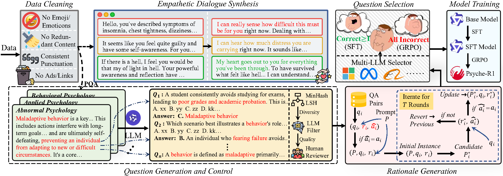

# Psyche-R1
<a href="./LICENSE"></a><a href='https://arxiv.org/pdf/2508.10848'></a>

[Psyche-R1: Towards Reliable Psychological LLMs through Unified Empathy, Expertise, and Reasoning](https://arxiv.org/pdf/2508.10848)

\[ English | [简体中文](README_zh.md) \]

## Latest News
🔥[2025.8.16] We have released the Chinese Psychological Reasoning LLM Psyche-R1! For model downloads, please click here: [MACLAB-HFUT/Psyche-R1](https://huggingface.co/MACLAB-HFUT/Psyche-R1)

## Introduction
Psyche-R1 is a Chinese psychological reasoning LLM that unifies empathy, expertise, and reasoning capabilities.
We propose a novel data synthesis pipeline, as illustrated in the figure below. Through processes including data cleaning, question generation, rationale iteration, and empathetic dialogue synthesis, we generated psychology QA pairs with detailed rationales, as well as empathetic dialogue data. Based on this, we utilize multi-LLM selection to filter out "challenge questions" to enhance the model's complex reasoning capabilities, while the remaining data is divided into "non-challenge questions."



We select [Qwen2.5-7B-Instruct](https://huggingface.co/Qwen/Qwen2.5-7B-Instruct) as the base model. The model first undergoes SFT on massive "non-challenge questions" (including psychological questions and empathetic dialogues) to infuse extensive expertise and empathetic capabilities. Subsequently, the model undergoes GRPO reinforcement learning based on "challenge questions" to further improve the model's complex reasoning abilities.

## Experimental Results
We present the results on the [Psychological Counselor Examination Benchmark (PCEB)](https://github.com/MACLAB-HFUT/PsycoLLM) which are shown below. 
<table>
    <thead>
        <tr>
            <th rowspan="2" align="left">Model</th>
            <th colspan="3" align="center">Case</th>
            <th colspan="3" align="center">Moral</th>
            <th colspan="3" align="center">Theory</th>
            <th rowspan="2" colspan="2" align="center">Avg.</th>
            <th colspan="3" align="center">Case (QA)</th>
        </tr>
        <tr>
            <th align="center">SMCQ</th>
            <th colspan="2" align="center">MMCQ</th>
            <th align="center">SMCQ</th>
            <th colspan="2" align="center">MMCQ</th>
            <th align="center">SMCQ</th>
            <th colspan="2" align="center">MMCQ</th>
            <th align="center">R-1</th>
            <th align="center">R-L</th>
            <th align="center">B-4</th>
        </tr>
    </thead>
    <tbody>
        <tr>
            <td align="left">Qwen2.5-7B-Instruct</td>
            <td align="center">47.57</td>
            <td align="center">31.64</td>
            <td align="center"><u>47.49</u></td>
            <td align="center">87.83</td>
            <td align="center">59.50</td>
            <td align="center"><u>71.02</u></td>
            <td align="center">78.46</td>
            <td align="center">42.45</td>
            <td align="center"><u>55.17</u></td>
            <td align="center">57.91</td>
            <td align="center">(<u>64.59</u>)</td>
            <td align="center">20.94</td>
            <td align="center">11.28</td>
            <td align="center">1.28</td>
        </tr>
        <tr>
            <td align="left">Qwen2.5-72B-Instruct</td>
            <td align="center">46.91</td>
            <td align="center">40.34</td>
            <td align="center"><u>53.11</u></td>
            <td align="center">90.79</td>
            <td align="center">70.25</td>
            <td align="center"><u>78.48</u></td>
            <td align="center">82.63</td>
            <td align="center">47.63</td>
            <td align="center"><u>59.74</u></td>
            <td align="center">63.09</td>
            <td align="center">(<u>68.61</u>)</td>
            <td align="center">21.43</td>
            <td align="center">12.02</td>
            <td align="center">1.16</td>
        </tr>
        <tr>
            <td align="left">DeepSeek-R1</td>
            <td align="center"><b>79.25</b></td>
            <td align="center">44.25</td>
            <td align="center"><u>60.86</u></td>
            <td align="center"><b>95.39</b></td>
            <td align="center">68.99</td>
            <td align="center"><u>77.95</u></td>
            <td align="center"><b>92.19</b></td>
            <td align="center">57.60</td>
            <td align="center"><u>69.41</u></td>
            <td align="center">72.95</td>
            <td align="center">(<b><u>79.18</u></b>)</td>
            <td align="center">17.65</td>
            <td align="center">9.19</td>
            <td align="center">0.94</td>
        </tr>
        <tr>
            <td align="left">DeepSeek-R1-70B</td>
            <td align="center">56.30</td>
            <td align="center">30.72</td>
            <td align="center"><u>46.95</u></td>
            <td align="center">88.16</td>
            <td align="center">52.53</td>
            <td align="center"><u>65.66</u></td>
            <td align="center">68.01</td>
            <td align="center">25.64</td>
            <td align="center"><u>45.63</u></td>
            <td align="center">53.56</td>
            <td align="center">(<u>61.79</u>)</td>
            <td align="center">22.77</td>
            <td align="center">13.23</td>
            <td align="center">1.16</td>
        </tr>
        <tr>
            <td align="left">QwQ-32B</td>
            <td align="center">56.51</td>
            <td align="center">23.35</td>
            <td align="center"><u>41.27</u></td>
            <td align="center">88.82</td>
            <td align="center">41.14</td>
            <td align="center"><u>53.06</u></td>
            <td align="center">82.12</td>
            <td align="center">32.69</td>
            <td align="center"><u>49.90</u></td>
            <td align="center">54.11</td>
            <td align="center">(<u>61.95</u>)</td>
            <td align="center">18.39</td>
            <td align="center">7.48</td>
            <td align="center">0.84</td>
        </tr>
        <tr>
            <td align="left">Qwen3-235B-A22B</td>
            <td align="center">68.58</td>
            <td align="center">41.91</td>
            <td align="center"><u>57.24</u></td>
            <td align="center">93.42</td>
            <td align="center">69.62</td>
            <td align="center"><u>78.90</u></td>
            <td align="center">88.36</td>
            <td align="center">56.70</td>
            <td align="center"><u>68.64</u></td>
            <td align="center">69.77</td>
            <td align="center">(<u>75.86</u>)</td>
            <td align="center">18.96</td>
            <td align="center">11.14</td>
            <td align="center">1.11</td>
        </tr>
        <tr>
            <td align="left">GPT-4o</td>
            <td align="center">65.63</td>
            <td align="center">13.67</td>
            <td align="center"><u>34.53</u></td>
            <td align="center">88.15</td>
            <td align="center">33.54</td>
            <td align="center"><u>54.79</u></td>
            <td align="center">74.65</td>
            <td align="center">24.10</td>
            <td align="center"><u>45.07</u></td>
            <td align="center">49.96</td>
            <td align="center">(<u>60.47</u>)</td>
            <td align="center">23.45</td>
            <td align="center">12.75</td>
            <td align="center">1.18</td>
        </tr>
        <tr>
            <td align="left">Claude3.7-Sonnet</td>
            <td align="center">63.39</td>
            <td align="center">19.40</td>
            <td align="center"><u>34.23</u></td>
            <td align="center">90.13</td>
            <td align="center">60.13</td>
            <td align="center"><u>70.04</u></td>
            <td align="center">76.73</td>
            <td align="center">37.37</td>
            <td align="center"><u>48.99</u></td>
            <td align="center">57.86</td>
            <td align="center">(<u>63.92</u>)</td>
            <td align="center">21.59</td>
            <td align="center">11.11</td>
            <td align="center">1.23</td>
        </tr>
        <tr>
            <td align="left">EmoLLM</td>
            <td align="center">46.93</td>
            <td align="center">21.87</td>
            <td align="center"><u>40.02</u></td>
            <td align="center">84.21</td>
            <td align="center">34.17</td>
            <td align="center"><u>51.05</u></td>
            <td align="center">71.72</td>
            <td align="center">26.18</td>
            <td align="center"><u>44.49</u></td>
            <td align="center">47.51</td>
            <td align="center">(<u>56.40</u>)</td>
            <td align="center">22.15</td>
            <td align="center">11.69</td>
            <td align="center">1.20</td>
        </tr>
        <tr>
            <td align="left">PsycoLLM</td>
            <td align="center">55.58</td>
            <td align="center">35.07</td>
            <td align="center"><u>42.89</u></td>
            <td align="center">88.81</td>
            <td align="center">69.62</td>
            <td align="center"><u>74.20</u></td>
            <td align="center">72.63</td>
            <td align="center">48.59</td>
            <td align="center"><u>54.12</u></td>
            <td align="center">61.72</td>
            <td align="center">(<u>64.71</u>)</td>
            <td align="center">24.45</td>
            <td align="center"><b>17.45</b></td>
            <td align="center">2.04</td>
        </tr>
        <tr>
            <td align="left">Psyche-R1</td>
            <td align="center">63.31</td>
            <td align="center"><b>56.26</b></td>
            <td align="center"><b><u>66.21</u></b></td>
            <td align="center">92.76</td>
            <td align="center"><b>79.62</b></td>
            <td align="center"><b><u>82.54</u></b></td>
            <td align="center">87.70</td>
            <td align="center"><b>66.54</b></td>
            <td align="center"><b><u>73.34</u></b></td>
            <td align="center"><b>74.37</b></td>
            <td align="center">(<u>77.64</u>)</td>
            <td align="center"><b>27.31</b></td>
            <td align="center">15.33</td>
            <td align="center"><b>2.40</b></td>
        </tr>
    </tbody>
</table>

<br>

We also conducted more detailed and comprehensive experiments, including experiments on [CPsyExam](https://aclanthology.org/anthology-files/anthology-files/pdf/coling/2025.coling-main.745.pdf) and [PsyDT](https://arxiv.org/pdf/2412.13660) test sets, demonstrating Psyche-R1's capabilities in psychological examinations and counseling. For detailed experimental results, please refer to the original paper.

## Quick Start
1. Clone this project locally
```bash
git clone https://github.com/MACLAB-HFUT/Psyche-R1.git
```
2. Set up the environment
```bash
conda create -n psycher1 python=3.10
conda activate psycher1
pip install -r requirements.txt
```
3. Run the Python file run.py
```python
deepspeed --num_gpus=1 run.py
```
4. Start interacting

## Acknowledgments
Model training is based on the [LLaMA-Factory](https://github.com/hiyouga/LLaMA-Factory) and [VeRL](https://github.com/volcengine/verl) frameworks.

We also thank the following students for their help with this project, including but not limited to data collection, data processing , and so on (in no particular order): Yuhang Deng, Yiduo Jin, Xiang Li, Yue Liu, Yan Luo, Weidong Wang, Jinming Yu

## Citation

If this work is helpful, please kindly cite as:

```bibtex
@misc{dai2025psycher1reliablepsychologicalllms,
      title={Psyche-R1: Towards Reliable Psychological LLMs through Unified Empathy, Expertise, and Reasoning}, 
      author={Chongyuan Dai and Jinpeng Hu and Hongchang Shi and Zhuo Li and Xun Yang and Meng Wang},
      year={2025},
      eprint={2508.10848},
      archivePrefix={arXiv},
      primaryClass={cs.CL},
      url={https://arxiv.org/abs/2508.10848}, 
}
```
